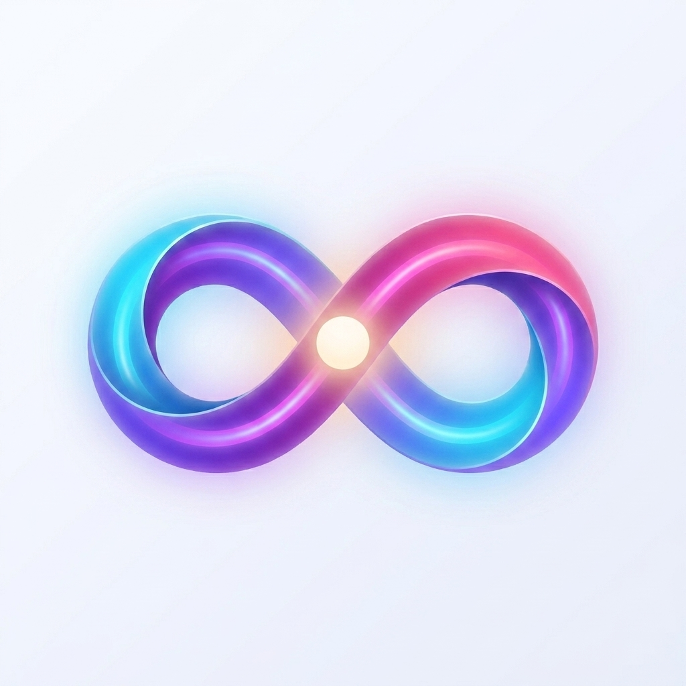
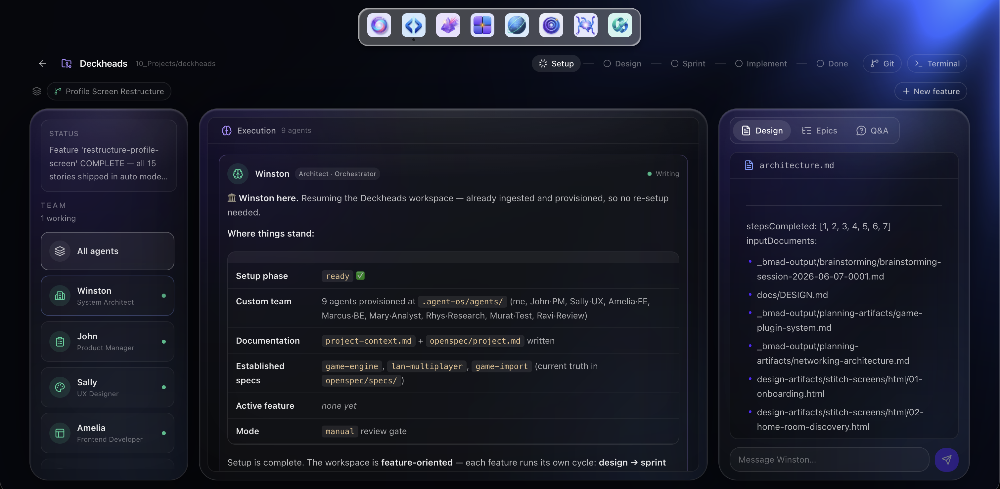
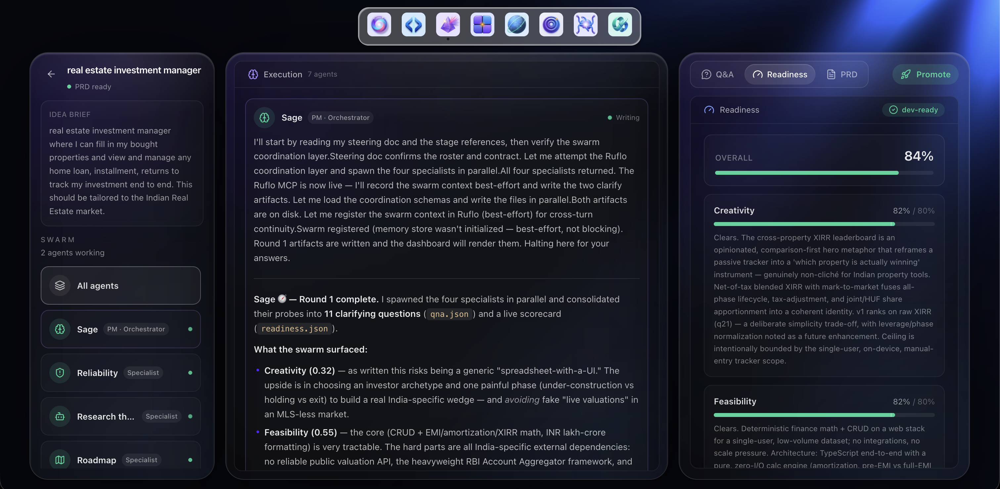
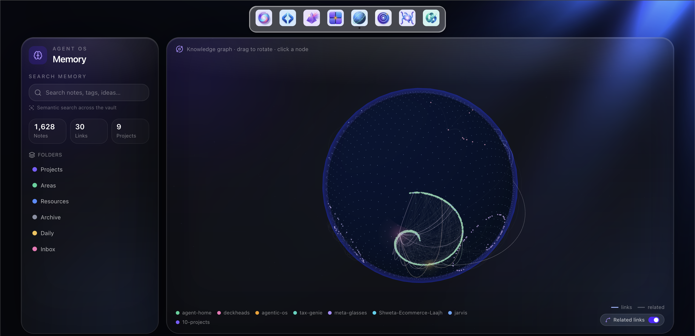
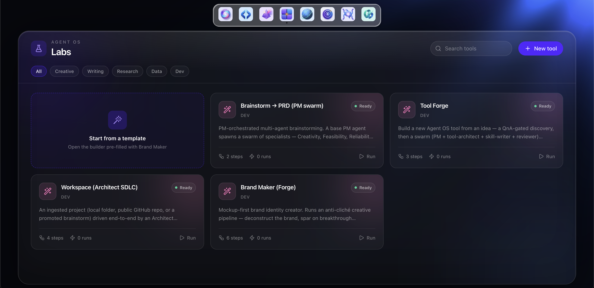
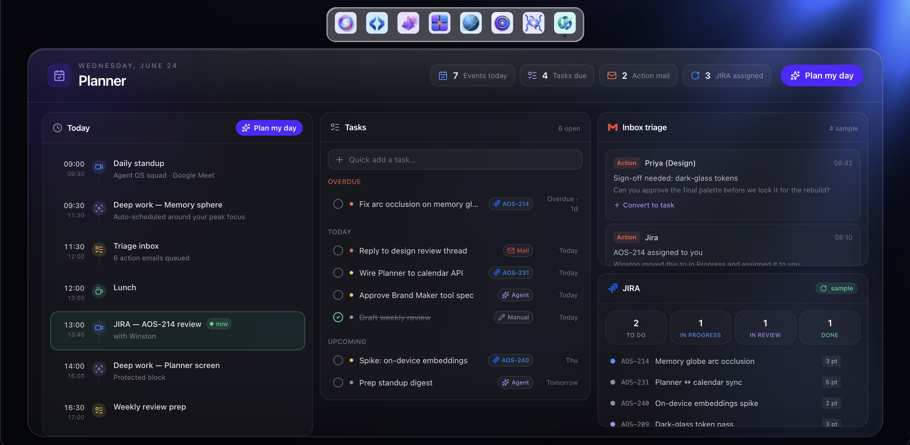
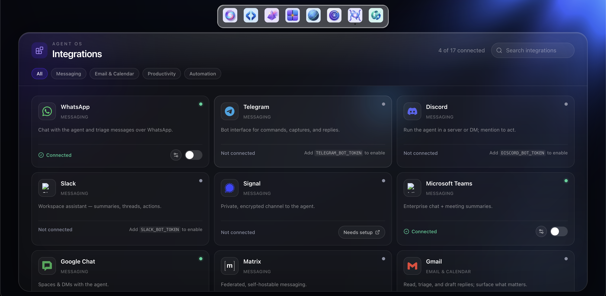
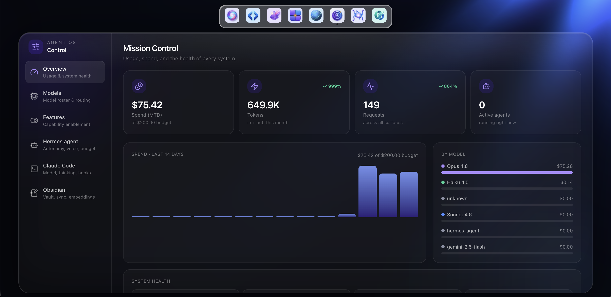
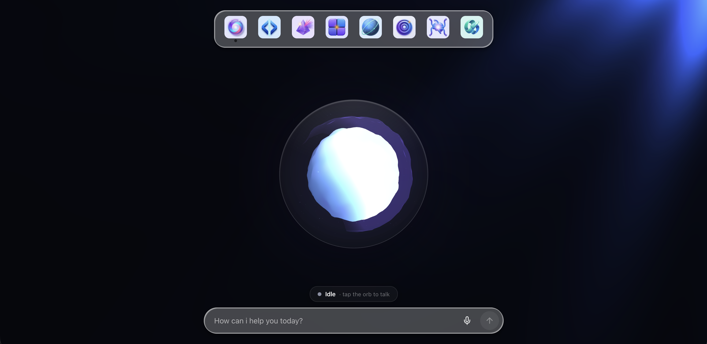

<!--
  NOTE FOR MAINTAINER: badges/links assume the repo is github.com/livelong99/eona-os.
  Add a real hero screenshot/GIF under docs/screenshots/ (see the Screenshots section).
-->

<div align="center">

<picture>
  <source media="(prefers-color-scheme: dark)" srcset="resources/branding/Brands/Eona/mark-dark.jpeg" />
  
</picture>

# Eona OS

**An endless, always-on intelligence for your local AI agents — Claude Code and a team of agents working together over your own Obsidian vault, on your own machine, with no per-token cost.**

[](LICENSE)
[](https://github.com/NousResearch/hermes-agent)
[](https://github.com/livelong99/eona-os/actions/workflows/ci.yml)
[](engine/pyproject.toml)
[](dashboard/package.json)
[](docker-compose.yml)
[](CONTRIBUTING.md)

[Quickstart](#-quickstart) · [Features](#-features) · [Architecture](#-architecture) · [Configuration](#-configuration) · [Contributing](#-contributing) · [FAQ](#-faq)

</div>

---

## What is Eona OS?

Eona OS is a **local-first orchestration platform for AI agents**. It puts a polished mission-control dashboard in front of a forked [Hermes Agent](https://github.com/NousResearch/hermes-agent) engine, and delegates the actual work to the **`claude` CLI using your Claude Code subscription** — so there's no per-token API bill. Multiple named agents plan, research, write, and ship in parallel, all sharing **one Obsidian vault as their long-term memory**.

Everything runs in Docker on `127.0.0.1`. Your notes, your code, and your conversations never leave your machine unless you explicitly send them somewhere.

> **Why it exists:** commercial agent IDEs are cloud-bound, metered per token, and own your context. Eona OS is the opposite — self-hosted, subscription-priced, and built on permissive open source you can read, fork, and extend.

### Why you might like it

- 🏠 **Local-first & private** — all services bound to `127.0.0.1`; your Obsidian vault is the brain, mounted read-write into the engine.
- 💸 **No per-token cost** — every turn is delegated to your **Claude Code subscription** via a local bridge, not a metered API.
- 🧠 **Shared memory** — agents read and write the same vault (PARA + wikilinks), with FTS5 session search and Qdrant vector recall.
- 🪄 **Mission-control UI** — eight purpose-built surfaces (Workspace, Brainstorm, Memory graph, Labs, Planner…) in a React 19 / three.js dashboard.
- 🔌 **Open & extensible** — built on Hermes Agent (MIT); add skills as plain `SKILL.md` files, swap providers, bring your own tools.
- 🧰 **Batteries included** — self-hosted web search (SearXNG), scraping (Crawl4AI), and vector memory (Qdrant) ship in the compose stack.

---

## 📸 Screenshots

<div align="center">
  
  <br/><sub><em>Home — talk to your agents, always on</em></sub>
</div>

<br/>

| Workspace | Brainstorm |
|:--:|:--:|
|  |  |
| **Memory** | **Labs** |
|  |  |
| **Planner** | **Integrations** |
|  |  |
| **Settings** | **Home** |
|  |  |

---

## ✨ Features

- **Multi-agent orchestration** — a Kanban dispatcher (`triage → todo → ready → running → blocked → done`) spawns parallel sub-agents, with an optional async "Hive" mode and a goal-loop runner.
- **Claude-subscription execution** — the engine routes every turn to the host `claude` CLI through a token-gated local bridge (no metered API key required).
- **Shared Obsidian memory** — agents share one vault via the Obsidian Local REST API and an MCP server; semantic recall is served by a self-hosted Qdrant.
- **Eight dashboard surfaces** — Home, Workspace (live run lanes + git panel), Brainstorm (ideation swarms), Labs (tool/agent builder), Memory (3D knowledge globe), Control, Integrations, Planner.
- **Skill system** — drop a `SKILL.md` + `tool.yaml` into the engine and it's discoverable at `/v1/tools`; brand/design and brainstorm workflows ship as examples.
- **Self-hosted tooling** — SearXNG web search and Crawl4AI page-to-markdown extraction replace paid SaaS equivalents.
- **OpenAI-compatible API** — the engine exposes `/v1/chat/completions` on `:8642`, so existing OpenAI clients can talk to it directly.

---

## 🏗 Architecture

A five-layer, local-first stack. Full detail in [`docs/architecture.md`](docs/architecture.md).

```
┌────────────────────────────────────────────────────────────┐
│  Dashboard (Vite 6 · React 19 · three.js)      :3737        │  ← mission control SPA
├────────────────────────────────────────────────────────────┤
│  Engine — forked Hermes Agent (FastAPI)        :8642        │  ← OpenAI-compatible API + Kanban
│    └─ delegates every turn to the host `claude` CLI :8765   │  ← your Claude Code subscription
├────────────────────────────────────────────────────────────┤
│  Memory   Obsidian vault (R/W)  +  Qdrant vectors  :6533    │  ← shared long-term brain
├────────────────────────────────────────────────────────────┤
│  Tools    SearXNG :8080   ·   Crawl4AI :11235              │  ← search & scrape (self-hosted)
└────────────────────────────────────────────────────────────┘
            all ports bound to 127.0.0.1
```

| Layer | Tech | Lives in |
|------|------|----------|
| Dashboard | Vite 6, React 19, TypeScript 5.6, Tailwind v4, three.js | [`dashboard/`](dashboard/) |
| Engine | Python 3.11–3.13, FastAPI, forked Hermes Agent, SQLite (WAL) | [`engine/`](engine/) |
| Config / profiles / skills | YAML + `SKILL.md` | [`hermes/`](hermes/) |
| Orchestration | Docker Compose v2 | [`docker-compose.yml`](docker-compose.yml) |
| Setup & ops | Bash / Python | [`scripts/`](scripts/) |

---

## 🚀 Quickstart

### Prerequisites

- **Docker Desktop** with Compose v2 (`docker compose version`)
- **Claude Code CLI** on your host (`claude --version`) + an active **Claude subscription**
- macOS (Apple Silicon, primary), Linux, or Windows via WSL2
- *(optional)* **Obsidian** with the Local REST API plugin, for shared-vault memory

### Install

```bash
# 1. Clone
git clone https://github.com/livelong99/eona-os.git
cd eona-os

# 2. Seed config + secrets and build the stack
scripts/install.sh

# 3. Mint a Claude subscription token, then paste it into ~/.hermes/.env
claude setup-token            # copies an sk-ant-oat…/cc-… value
#   → set CLAUDE_CODE_OAUTH_TOKEN= in ~/.hermes/.env

# 4. Re-run install to finish bringing the stack up
scripts/install.sh

# 5. Start the Claude delegation bridge (separate terminal, keep it running)
set -a; . ~/.hermes/.env; set +a
BRIDGE_TOKEN=$CLAUDE_BRIDGE_TOKEN BRIDGE_HOST=0.0.0.0 python3 scripts/claude-bridge.py
```

Then open **<http://127.0.0.1:3737>**.

### Verify & manage

```bash
scripts/doctor.sh            # read-only health checks
docker compose ps            # service status
scripts/install.sh --wipe    # tear down containers + volumes (keeps your secrets)
```

---

## ⚙️ Configuration

Secrets and runtime config live in **`~/.hermes/`** (seeded by `install.sh`, never committed).

| Variable (`~/.hermes/.env`) | Purpose | Source |
|---|---|---|
| `CLAUDE_CODE_OAUTH_TOKEN` | Your Claude subscription — the only required credential | `claude setup-token` |
| `API_SERVER_KEY` | Bearer token for the engine API on `:8642` | auto-generated |
| `CLAUDE_BRIDGE_TOKEN` | Shared token for the local delegation bridge | auto-generated |
| `MCP_OBSIDIAN_API_KEY` | Obsidian Local REST API token (optional) | Obsidian plugin |

### Ports (all `127.0.0.1`)

| Port | Service | Exposure |
|---|---|---|
| `3737` | Dashboard (nginx SPA + API proxy) | you |
| `8642` | Engine — OpenAI-compatible API + `/health` | you |
| `8765` | Claude delegation bridge | host-only |
| `8080` | SearXNG web search | internal |
| `11235` | Crawl4AI scrape/extract | internal |
| `6533` | Qdrant vector memory (`→ 6333` in-container) | internal |
| `27123` | Obsidian Local REST API (optional) | host-only |

Non-secret config (agent profiles, tool settings, bundled skills) lives in [`hermes/`](hermes/) and is copied to `~/.hermes/` on install.

---

## 🗺 Roadmap

- [ ] One-command `docker compose up` path that doesn't need the host bridge
- [ ] First-run setup wizard in the dashboard
- [ ] Pluggable provider tiers (Gemini / OpenRouter fallback, opt-in)
- [ ] Skill marketplace / registry
- [ ] Windows-native (non-WSL) support

Have an idea? [Open a feature request](https://github.com/livelong99/eona-os/issues/new/choose).

---

## 🤝 Contributing

Contributions are very welcome — code, docs, skills, bug reports, and ideas all count. Start with **[CONTRIBUTING.md](CONTRIBUTING.md)** and our **[Code of Conduct](CODE_OF_CONDUCT.md)**.

```bash
# Dashboard
cd dashboard && npm install && npm run dev      # http://localhost:5173
npm run typecheck                               # strict TS

# Engine (Python)
cd engine && python -m pip install -e .         # editable install
```

Good first contributions: new `SKILL.md` tools, dashboard polish, docs, and platform-support fixes (Linux/WSL2).

---

## 🔒 Security

Found a vulnerability? **Please don't open a public issue** — see [SECURITY.md](SECURITY.md) for private disclosure. Eona OS is local-first and ships secrets-free; never commit `~/.hermes/.env` or put credentials in your vault.

---

## ❓ FAQ

<details>
<summary><strong>Does this cost money per request?</strong></summary>

No. Work is delegated to the host `claude` CLI using your existing Claude Code **subscription**, so there's no per-token API charge. You only need an active subscription.
</details>

<details>
<summary><strong>Do I have to use Obsidian?</strong></summary>

It's optional but recommended — the shared vault is what gives agents persistent, linkable memory. Without it you still get orchestration and the dashboard; you just lose the long-term shared brain.
</details>

<details>
<summary><strong>Is my data sent anywhere?</strong></summary>

Only to Anthropic when the `claude` CLI runs a turn. Every other service (search, scraping, vectors, dashboard) is self-hosted and bound to `127.0.0.1`.
</details>

<details>
<summary><strong>What platforms work?</strong></summary>

macOS (Apple Silicon) is the primary target. Linux and Windows (WSL2) work via Docker. Native Windows is on the roadmap.
</details>

---

## 📜 License & Acknowledgements

Eona OS is released under the **[MIT License](LICENSE)** — © 2026 Vaibhav Chaudhary.

It stands on the shoulders of excellent open source. Full attributions are in [`NOTICE`](NOTICE); the highlights:

- **[Hermes Agent](https://github.com/NousResearch/hermes-agent)** by **Nous Research** (MIT) — the engine runtime in [`engine/`](engine/) is a fork.
- **SearXNG**, **Crawl4AI**, **Qdrant** — self-hosted search, scraping, and vector memory.
- **ONNX Runtime Web** (Microsoft), **openWakeWord**, **JetBrains Mono** (SIL OFL 1.1), and the wider React / FastAPI ecosystems.

External tools invoked at runtime (the `claude` CLI and others) are not bundled or redistributed.

<div align="center">
<sub>Built for people who'd rather own their agents than rent them. ⭐ the repo if that's you.</sub>
</div>
